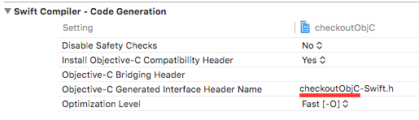
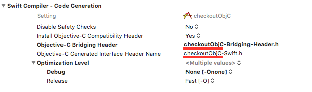
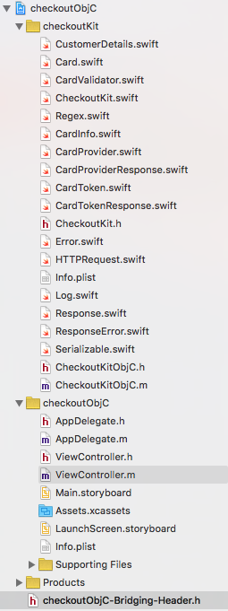

### Requirements

Objective-C, iOS 7.0 and later

If you are using Swift, please refer to the [master branch](https://github.com/CKOTech/checkoutkit-ios).

### How to use the library

__Manually__

CheckoutKit for iOS is originally written in Swift. All unit tests can be run by using the Swift source code.

In order to be used inside an Objective-C project, this modified CheckoutKit source code should be used.

Follow the below instructions to make your Objective-C project ready to use the CheckoutKit functionalities:


1. Download or clone the [github repository](https://github.com/CKOTech/checkoutkit-ios/tree/objective-c). Copy the CheckoutKit folder to your project directory in finder, and then drag and drop it to your project in Xcode and choose the "Create groups" option.

2. Go to the "Build Settings" of the project (not the target) and set the below:
  * Inside "packaging": set "Defines Module" to "Yes"
  * Make sure "Product Module Name" is set to your project name. NB: Your project name should not include spaces
  * The "Swift Compiler - Code Generation" part should look as below (the underlined part should be equal to your project name):



3. Create an empty header file inside the same directory of your .xcodeproj file and name it ```YOURPROJECTNAME-Bridging-Header.h```

4. Go to the "Build Settings" of the target (not the project) and set the below:
  * Inside "packaging": make sure "Defines Module" is set to "Yes"
  * Make sure "Product Module Name" is set to your project name. NB: Your project name should not include spaces
  * The "Swift Compiler - Code Generation" part should look as below (the underlined parts should be equal to your project name):



5. Go to CheckoutKitObjcC.h and replace ```#import "checkoutObjC-swift.h"``` with ```#import "YOURPROJECTNAME-swift.h"```

6. Your project structure should now be similar to the below:



You may need to **Clean** your project and build again if you get compilation errors.
If you are still failing to compile, kindly make sure you haven't missed any of the configuration steps.


The project is now ready to use the CheckoutKit library.


### Example

Import headers
```
#import "YOURPROJECTNAME-swift.h"
#import "checkoutKit/CheckoutKitObjC.h"
#import "checkoutKit/CardTokenResponse.h"
#import "checkoutKit/CardProviderResponse.h"
```

[...]


Instantiate a checkoutKit instance:
```
CheckoutKitObjC *checkoutKitInstance = [[CheckoutKitObjC alloc] init];
[checkoutKitInstance setPublicKey:@"YOUR_PUBLIC_KEY"];
[checkoutKitInstance setEnvironment:@"SANDBOX"]; //To be changed to LIVE when going live
```

**Get the card providers list:**

```
[checkoutKitInstance getCardProviders:^(CardProviderResponse *providersResponse){
        NSArray *providersArray = providersResponse.data;
        int providersCount = providersResponse.count;
        
        for (int i = 0; i < providersCount; i++)
        {
            CardProvider *testProvider = [providersArray objectAtIndex:i];
            
            NSLog(@"%@", testProvider.name);
            NSLog(@"%@", testProvider.id);
        }
        
    } failure:^(NSError *error) {
        NSLog(@"%@", [error valueForKey:@"errors"]);
        NSLog(@"%@", error);
    }];
```

Create card object and fill it:
```
Card *card = [Card alloc];

[card setNumber:@"4242424242424242"];
[card setName:@"John Doe"];
[card setCvv:@"100"];
[card setExpMonth:@"06"];
[card setExpYear:@"18"];
```

Test the validity of the values passed to the card object, returns true if all fields are verified and false (with the error logged in the console) if not:
```
bool testCardValidity = [card verify];
```

Create and fill in customer details (optional):
```
CustomerDetails *customerDetails = [CustomerDetails alloc];
[customerDetails setAddress1:@"flat 100"];
[customerDetails setAddress2:@"Oxford Street"];
[customerDetails setPostCode:@"N12 345"];
[customerDetails setCountry:@"GB"];
[customerDetails setCity:@"London"];
[customerDetails setState:@""];
```

Create a phone object to add to the customer details:
```
Phone *phone = [Phone alloc];
[phone setNumber:@"0712345678"];
[phone setCountryCode:@"44"];

[customerDetails setPhone:phone];
```

Set the customer details to the card:
```
[card setBillingDetails:customerDetails];
```

**Request a card token and handle asynchronous success / failure response:**

```
[checkoutKitInstance createCardToken:card success:^(CardTokenResponse *responseDict){
        
    NSLog(@"%@",responseDict.cardToken);
    NSLog(@"%@", responseDict.card);
        
    } failure:^(NSError *error) {
    NSLog(@"%@", [error valueForKey:@"errors"]);
    NSLog(@"%@", error);
    }];
```